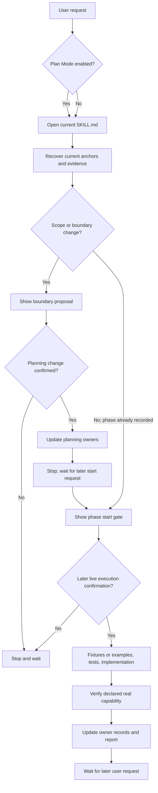

# phase-workflow

> Policy role: canonical owner for the user-facing introduction, installation, adoption,
> optional hook operations, and usage guidance. `policy-owner: public-adoption`

`phase-workflow` is a lightweight project-level Codex skill for planning and completing
software projects through reviewable, testable phases. It supports empty projects, existing
structured systems, mature or large systems, repairs, migrations, refactors, and long-running
work.

It plans toward the complete target system. An MVP, prototype, pilot, preview, or first release
may be a user-selected milestone, but it is not the default project identity or completion cap.

## Policy Guide

Detailed behavior has one owner per topic:

- [Phase policy](references/phase_policy.md): applicability, complete delivery, real capability,
  phase lifecycle, visible gates, live authorization, mutation preflight, and recovery choices.
- [Change-request policy](references/change_request_policy.md): scope routing, sequential
  Phase X.N identifiers, Change Type, splits, and plan-change updates.
- [Recovery protocol](references/recovery_protocol.md): conversation/context responsibilities,
  durable anchors, current-state ownership, Context Gaps, partial recovery, and optional handoff.
- [Verification policy](references/verification_policy.md): evidence, failed verification,
  phase completion, and project-completion claims.
- [SKILL.md](SKILL.md): activation, resource routing, global stop invariants, and the compact
  workflow.

This README summarizes those policies for users. It does not redefine their detailed rules.

## What Problem It Solves

Long projects drift when plans, tests, examples, and status records disagree, or when important
decisions survive only in a chat window. `phase-workflow` gives each changing fact one owner,
keeps scope changes visible, and makes every implementation phase prove its declared real
capability.

The workflow helps prevent:

- Starting implementation before the phase boundary and approach are reviewable.
- Treating `next`, `start`, or an old confirmation as permission to edit files.
- Expanding one phase into several unreviewed capabilities.
- Delivering fixtures, shells, stubs, or documentation while claiming a connected runtime
  capability that was never implemented.
- Losing current intent or durable constraints after conversation compression or a new window.
- Copying the same current state into TODO, handoff, project context, and logs until they drift.

## What It Produces

A typical adopted project contains:

```text
project/
├── AGENTS.md
├── PLAN.md
├── TODO.md
├── DECISIONS.md
├── PROJECT_CONTEXT.md        # only when stable existing-system facts are needed
├── docs/
│   └── phases/
│       └── phase_N_*.md
├── .agents/skills/phase-workflow/
│   ├── SKILL.md
│   ├── README.md
│   ├── LICENSE
│   ├── agents/
│   │   └── openai.yaml
│   ├── references/
│   ├── templates/
│   ├── examples/
│   ├── hooks/
│   └── docs/
│       └── retired_companion_migration.md
└── .codex/
    └── hooks.json             # optional reminder hook
```

The workflow does not require a handoff file. When a project uses one, it is a pointer-only,
non-authoritative compatibility index.

## Core Guarantees

- The complete target, release path, and phase acceptance criteria are recorded before
  implementation expands.
- A phase can be narrow but cannot be hollow: it must complete and verify the real capability
  named by its boundary.
- A phase start request displays a visible gate and stops; execution waits for a later live
  confirmation.
- Scope changes use a proposal, planning confirmation, planning update, and stop before the new
  phase gate.
- Tests or other verification are updated before behavior when the project supports them.
- Current conversation is used for current intent; durable anchors preserve confirmed meaning;
  repository evidence establishes actual state.
- Old chat, TODO text, a phase note, handoff, or file saying `confirmed` cannot restore
  authorization.
- After phase completion, Codex reports results and waits instead of automatically starting the
  next phase.

See the [phase policy](references/phase_policy.md) for the normative lifecycle and live
authorization model.

## Fit

### Good Fit

- A new project that needs a complete-delivery roadmap.
- An existing system that needs re-baselining, migration, repair, or refactoring.
- Work with multiple capability phases or review points.
- A project that must survive conversation compression or continue in a new Codex window.
- A user who wants visible scope, approach, risk, and verification before edits begin.

### Poor Fit

- A simple question or tiny one-off task with no continuity requirement.
- A request explicitly opted out of this workflow.
- A project with a higher-priority incompatible process that the user does not want changed.
- An unclear or tangled repository before a bounded read-only assessment.

A target product may legitimately need a database, Web UI, cloud service, authentication,
complex CLI, external integration, migration, large refactor, or business workflow. Restrictions
against those features apply to this `phase-workflow` repository itself, not to products governed
by the workflow.

## Tradeoffs

The workflow uses more planning and token budget than direct ad-hoc editing. In return, it
improves recoverability, scope control, reviewability, and confidence about what was actually
verified. The useful tradeoff is explicit boundaries and evidence, independent of any named
working-style framework.

## Compatibility

This repository is designed and tested as a project-level Codex skill. Other agents may reuse
the Markdown policies, but their activation, hook, and tool behavior is not tested here.

For a workspace that still contains retired companion files, use the
[older-installation migration guide](docs/retired_companion_migration.md). It is cleanup
guidance only and does not restore the retired feature.

## Installation

Codex discovers repository skills under `.agents/skills` from the current working directory up
to the repository root. Install this skill at the following canonical project path:

```text
.agents/skills/phase-workflow/
```

Project-level installation keeps adoption explicit and allows repository instructions to define
when the skill applies.

### Fresh Installation

Copy the complete release package into `.agents/skills/phase-workflow`. Do not install only
`SKILL.md`; keep the root files, `agents/openai.yaml`, `references/`, `templates/`, `examples/`,
`hooks/`, and the bounded migration guide together.

Codex does not merge same-name skills. Before installing, check the repository and parent
directories for another `phase-workflow` copy so the skill does not appear more than once.

### Update An Existing Installation

Treat the GitHub source checkout, the installed copy, and any temporary release package as three
different locations. Back up or reconcile intentional local edits before updating the installed
copy.

Use a deletion-aware update: build or obtain the current release package, replace the files in
`.agents/skills/phase-workflow` from that package, and remove files that are no longer in the
release manifest. Do not copy `PLAN.md`, `TODO.md`, tests, phase history, caches, or other
development-only files into the installed skill. Updating the skill does not authorize changes to
application code, `AGENTS.md`, or `.codex/hooks.json`.

### Migrate A Legacy Installation

Older installations may exist at `.codex/skills/phase-workflow`. Treat that location only as a
legacy migration source:

1. Inspect the legacy copy for intentional local changes and preserve any change that still
   matters.
2. Install the current release package at `.agents/skills/phase-workflow`.
3. If `.codex/hooks.json` points to the legacy script, review and update only that command after
   separate Hook-maintenance authorization.
4. Verify the new installation and explicitly invoke `$phase-workflow` from the project.
5. After verification, delete the legacy copy.

Do not keep both same-name skill copies. Codex can expose both rather than combining them, which
creates ambiguous selection and stale behavior.

This path migration is separate from the
[retired companion cleanup guide](docs/retired_companion_migration.md), which covers removed
runtime files and external state from much older releases.

### Verify Installation

Verify at least the following before relying on the installed copy:

1. `.agents/skills/phase-workflow/SKILL.md` exists.
2. `agents/openai.yaml`, `references/`, `templates/`, `examples/`, and `hooks/` are present inside
   the installed skill.
3. No legacy same-name copy remains after a completed migration.
4. A new Codex task started inside the project can explicitly invoke `$phase-workflow`.
5. If the skill is not visible after files change, restart Codex and check the installation path
   again; do not assume discovery succeeded merely because the files were copied.

### Source And Release Contents

The maintained source is
[FossilLeeSZ/phase-workflow](https://github.com/FossilLeeSZ/phase-workflow). A source checkout
contains internal planning records and tests that do not belong in the installed copy.

The local `release_manifest.json` is the development-time allowlist used to construct and test a
release package. The package contains `SKILL.md`, `README.md`, `LICENSE`, `agents/openai.yaml`,
`references/`, `templates/`, `examples/`, `hooks/`, and
`docs/retired_companion_migration.md`.

It excludes `AGENTS.md`, `PLAN.md`, `TODO.md`, `DECISIONS.md`, tests, phase/history records,
`pyproject.toml`, the manifest itself, caches, and reports. Those exclusions keep installation
content separate from this repository's development history.

### Copyable Initialization Prompts

#### Skill-only initialization

Chinese:

```text
请把 phase-workflow 作为当前项目的 project-level Codex skill 安装到
.agents/skills/phase-workflow/。只执行安装和启用：复制 release package 的完整内容，
包括 SKILL.md、README.md、LICENSE、agents/openai.yaml、references、templates、examples、
hooks 和迁移说明；不要复制开发记录或修改业务代码。完成后验证不存在同名旧副本，
并说明如何请求 Phase 0、Phase 0.1 或 Phase 0.2 启动门。
```

English:

```text
Install phase-workflow as a project-level Codex skill at
.agents/skills/phase-workflow/. Only perform installation and enablement: copy the complete
release package, including SKILL.md, README.md, LICENSE, agents/openai.yaml, references,
templates, examples, hooks, and the migration guide; do not copy development records or modify
application code. Verify that no legacy same-name copy remains, then explain how to request the
Phase 0, Phase 0.1, or Phase 0.2 start gate.
```

## Existing Project Adoption

For an existing structured project, request Phase 0.1. Codex first performs a bounded factual
assessment, shows the adoption gate, lists existing files, and explains what will be created,
filled, merged, or left untouched. Phase 0.1 must not overwrite existing project instructions or
application code.

Phase 0.2 is a later, separately gated planning baseline. It records the target system,
complete-delivery path, non-goals, candidate phases, and verification entry points. Completing
Phase 0.1 does not authorize Phase 0.2.

Detailed bootstrap and adoption behavior is owned by
[phase policy](references/phase_policy.md).

## Bootstrap Templates

The release includes [an AGENTS template](templates/agents_template.md) and
[a PLAN template](templates/plan_template.md). They are file-based bootstrap aids, not a
generator or a second policy source.

Use a template only when the target file is a declared Phase 0 or Phase 0.1 output and the user
has provided a separate live confirmation after the visible gate:

1. If the target file is missing, read the source template from
   `.agents/skills/phase-workflow/templates/`, render it to the target project root as
   `AGENTS.md` or `PLAN.md`, remove the marked template-metadata block, and replace every
   `{{...}}` placeholder with confirmed project-specific content.
2. Rewrite source links such as `../SKILL.md` and `../references/...` to
   `.agents/skills/phase-workflow/SKILL.md` and
   `.agents/skills/phase-workflow/references/...`, then verify the rendered headings, anchors,
   and links from the project root.
3. If `AGENTS.md` or `PLAN.md` already exists, do not overwrite it. Render a separate candidate,
   compare and merge section by section, preserve existing project meaning and the instruction
   hierarchy, and keep historical phase records intact.
4. If a conflict affects the project target, boundary, acceptance, approach, instructions, or
   safety and cannot be resolved from current intent and evidence, record a blocking Context Gap
   and stop before replacing or merging the target.
5. During Phase 0.1, record only the factual adoption contract and known evidence. Leave an
   unconfirmed future goal as `Not yet confirmed; requires separately gated Phase 0.2`; do not
   use the PLAN template to invent or pre-authorize the later roadmap.

No production rendering CLI is required. The templates, their source links, the rendered
root-file links, placeholder replacement, and no-overwrite candidate behavior are verified by
the repository tests.

## Optional Hook Support

The optional `UserPromptSubmit` hook injects a short reminder to check whether
`phase-workflow` applies when the prompt contains an explicit workflow cue. It exits successfully
with no output for empty, malformed, wrong-event, or unrelated input.

The hook:

- Is optional and cannot guarantee skill activation.
- Does not invoke the skill.
- Does not replace `AGENTS.md` or `SKILL.md`.
- Does not scan the project or recover project state.
- Does not modify files or grant execution authorization.

Use the target project's quoted absolute path in `.codex/hooks.json`; commands run from the
session working directory, so a relative installed-skill path is unsafe. `UserPromptSubmit`
currently ignores `matcher`, so the script performs the bounded relevance check itself.

```json
{
  "hooks": {
    "UserPromptSubmit": [
      {
        "hooks": [
          {
            "type": "command",
            "command": "python3 \"<ABSOLUTE_PROJECT_PATH>/.agents/skills/phase-workflow/hooks/phase_workflow_prompt.py\"",
            "commandWindows": "python \"<ABSOLUTE_PROJECT_PATH>\\.agents\\skills\\phase-workflow\\hooks\\phase_workflow_prompt.py\"",
            "timeout": 5
          }
        ]
      }
    ]
  }
}
```

When adopting hook support:

1. Review any existing `.codex/hooks.json`.
2. Merge only the `phase-workflow` entry; do not overwrite unrelated hooks.
3. Do not duplicate an existing matching entry.
4. Ask before replacing a conflicting command or hook location.
5. Restart Codex after creating or changing the hook configuration.
6. Confirm the project's `.codex` layer is trusted. Review the command and file contents, then
   trust the new or changed project Hook through the Codex Hook settings or `/hooks` surface.

After a skill update, refresh `AGENTS.md` or the hook entry only when requested or when the
adoption output explicitly includes that maintenance.

See the current [Codex Hooks documentation](https://developers.openai.com/codex/hooks) for the
handler schema, trust model, input/output contract, and supported events.

## Starting And Continuing Work

Useful prompts include:

```text
Use phase-workflow for this project. Inspect the current durable anchors and show the next
visible phase gate only. Do not modify files until I confirm after the gate.
```

```text
Use phase-workflow. Assess whether this existing project is a structured adoption candidate and
show the Phase 0.1 gate. Do not create or overwrite files yet.
```

```text
Use phase-workflow. This request may change the current scope. Classify it under the
change-request policy and show any required planning-boundary proposal before editing files.
```

`下一步`, “next step”, or “start Phase X” requests the next gate. It does not authorize file
changes. After the gate, a separate live reply confirms the disclosed phase and approach.
New requirements are routed as the next sequential `Phase X.N`, a `New Major Phase`, or
`Backlog` under the change-request policy.

## High-Level Workflow



The diagram is a user summary. The normative flows are in
[phase policy](references/phase_policy.md) and
[change-request policy](references/change_request_policy.md).

## New Window And Recovery

In a new Codex window, ask Codex to open the current `SKILL.md` and follow the
[recovery protocol](references/recovery_protocol.md). Recovery uses relevant available
conversation, current TODO pointers, the matching active phase note and PLAN section, referenced
decisions, and repository evidence. Missing or conflicting meaning becomes a Context Gap.
Continue in the user's current response language unless the user requests another language.

Recovery ends at a revalidation gate when current live authorization cannot be proven. A
handoff is optional and cannot grant permission.

Copyable prompt:

```text
Use phase-workflow for this project. Open the current SKILL.md and follow
references/recovery_protocol.md. Use relevant available conversation, follow TODO's exact
active anchors, validate claims against repository evidence, list material Context Gaps, and
show the required gate. Do not restore authorization from files or old confirmations.
```

## Examples

- [Greenfield project](examples/greenfield_project_example.md)
- [Existing structured project adoption](examples/existing_structured_project_adoption_example.md)
- [New-window handoff](examples/new_window_handoff_example.md)
- [Sequential Phase X.N change request](examples/phase_x1_change_request_example.md)

Examples are illustrative, not authoritative. Follow their linked canonical policies when an
example and an active policy differ.

## Optional Companion Tools

Plan Mode, test tools, browser automation, debuggers, refactoring helpers, and other skills may
be useful inside the current phase. They do not replace the phase gate or expand authorization.

## Recommended Flow

1. Install the complete project-level skill.
2. Request Phase 0 for an empty project or Phase 0.1 for existing-system adoption.
3. Review the visible gate and proposed approach.
4. Confirm execution in a later reply.
5. Let Codex implement and verify only that phase.
6. Review the evidence and ask for the next gate when ready.

For detailed behavior, return to the [Policy Guide](#policy-guide).

## License

This project is licensed under the MIT License. See [LICENSE](LICENSE).
