# phase-workflow

`phase-workflow` is a lightweight Codex workflow skill for early-stage, greenfield,
and MVP software projects. It helps keep long-running development work small,
explicit, verifiable, and recoverable across Codex sessions.

Its main purpose is not to make Codex plan. Codex can already plan. Its purpose is
to make planning, scope control, verification, and handoff repeatable through
project files instead of chat history.

Casually speaking, it helps everyone borrow useful MBTI J habits: clear phase boundaries,
explicit decisions, and verified next steps. The engineering value is that new Codex windows
can recover the work from files, and long conversations do not have to keep compressing
context until stale assumptions, lost decisions, mixed context, or scope drift creep in.

The workflow is simple:

1. Lock the current phase boundary.
2. Output a visible start gate and wait for separate confirmation.
3. Update planning files before technical work starts.
4. Confirm any non-trivial execution approach before related file changes.
5. Prepare fixtures or examples.
6. Write failing tests.
7. Implement the smallest useful capability.
8. Verify with actual commands.
9. Update TODO, phase notes, and handoff documents.
10. Move to the next phase only after verification.

The project is not a business application, a RAG system, a web UI, or a code
generation framework.

## What Problem It Solves

Early projects drift because scope, examples, tests, and handoff notes fall out of
sync. `phase-workflow` keeps them synchronized through a repeatable phase rhythm.

This is a scope-control workflow skill, not just a planning template. It prevents a
phase from silently absorbing future work. New ideas are classified before
implementation instead of being added directly to the active phase:

- `Phase X.N` sub-phase, such as `Phase X.1` or `Phase X.2`
- `New Major Phase`
- `Backlog`

The goal is not to add process for its own sake. The goal is to make new project
work recoverable across Codex sessions without relying on chat history or a
compressed long conversation.

## What It Produces

A project using this workflow usually maintains:

- `AGENTS.md` - repository-level rules for Codex
- `PLAN.md` - phase roadmap and execution input
- `TODO.md` - current phase, active task, next tasks, blockers, and do-not-do-yet
- `DECISIONS.md` - durable decisions only
- `PROJECT_CONTEXT.md` - adoption/background baseline for existing structured project adoption
- phase notes - historical phase scope, modified files, verification, risks, and next steps
- handoff notes - compact current state for new Codex sessions

`DEV_LOG.md` is not a baseline workflow file. Legacy `DEV_LOG.md` files may remain in adopted
projects, but the workflow no longer requires creating, reading, or updating them.

The output is not a complex tool. The output is recoverable project state that a
new Codex window can read before editing files.

## Core Guarantees

When used correctly, `phase-workflow` aims to ensure that:

- every phase has a narrow goal and explicit non-goals;
- phase start gates stop for separate confirmation before edits;
- phase boundaries stay explicit and do not advance automatically;
- examples or fixtures define behavior before implementation;
- tests or verification criteria guide the smallest useful change;
- verification commands are actually run and recorded;
- mutation branches separate planning, technical work, status/handoff records, and recovery;
- the next Codex session can resume from a recoverable handoff in project files.

Fixtures and tests are not ceremony. They define expected behavior before
implementation begins. A phase is not complete until verification results are
recorded; "should work" is not an exit criterion.

When a request includes multiple phases, multiple verification loops, or multiple independent
outputs, only the currently confirmed phase may execute.
Scope-changing work is recorded before technical work starts.
Plan-change confirmation stops after planning-file updates.

Classify mutation branches by change intent and content, not by file name alone. `TODO.md`,
phase notes, and handoff notes can contain planning-file mutations or status/handoff-record
mutations. Scope, phase boundary, active task, acceptance criteria, or roadmap changes are
planning-file mutations. Verification results, current status, and handoff summaries are
status/handoff-record mutations.

If an approved boundary has already been crossed, new implementation stops. Recovery uses a
read-only audit and chat-visible incident report before user choice, then repairs records only
after the user chooses keep-and-audit or rollback.

For detailed rules, read `SKILL.md` and the files in `references/`.

## Tradeoffs

`phase-workflow` may use more tokens than an ad hoc Codex chat because Codex checks
phase boundaries, records verification results, and maintains handoff notes.

The tradeoff is intentional: the workflow spends extra context on recoverability,
scope control, verification, and new-window handoff.

This has not been benchmarked yet. Actual token usage will depend on project size,
how many workflow files are read, and how often phases or sub-phases are updated.
Measured reports or practical suggestions are welcome.

To keep recovery context small, new Codex windows should start from `AGENTS.md`, the first
80-120 lines of the latest compact handoff or current-state file, and the current `TODO.md`
phase/task/blocker sections. Do not read full `PLAN.md`, `DECISIONS.md`,
`PROJECT_CONTEXT.md`, full `TODO.md`, full handoff files, or full phase notes by default.
Treat `PLAN.md`, `DECISIONS.md`, `PROJECT_CONTEXT.md`, full `TODO.md`, full handoff files,
and phase notes as targeted or on-demand recovery sources. Use `rg` or scoped section reads
when scope changes, conflicts, missing verification, unclear decision sources, or explicit
history requests require more history.

The compact handoff/current-state file is not a complete history, audit log, phase table, or
`PLAN.md` summary. It should contain the current recoverable state: project summary, current
phase, recently completed work, last verification, blockers, next action, and do-not-do
items. Historical completed task lists belong in phase notes. `TODO.md` should keep only
current phase, active task, next tasks, blockers, and do-not-do-yet in the default recovery
area.

The same bounded-read rule applies when updating phase-exit or end-of-round records. Do not
read large workflow files in full just to update status records; update the relevant TODO
sections, phase note, and compact handoff. Update DECISIONS only for durable decisions. Use
heading-scoped reads for phase notes, handoff notes, `PLAN.md`, `DECISIONS.md`, and
`PROJECT_CONTEXT.md`.

Phase 15 planning guidance supports two paths. Codex-only: the default path. In this path,
Codex reads bounded recovery context, shows gates, validates authorization, executes
commands, and edits files after confirmation. ChatGPT/MCP planning with Codex execution: an
optional path. In this path, ChatGPT may use the read-only MCP companion through an available
connector path to read bounded project context and produce a short handoff prompt for Codex.
The MCP path is optional and selected by the user. Codex-direct MCP planning is not a Phase
15 supported mode. The local MCP companion must not call Codex, run `codex exec`, start
Codex, or use Codex as a compression backend.

Default recovery snapshot contract: ChatGPT/MCP default snapshot must match the bounded
recovery context Codex would read. Default snapshot includes `AGENTS.md`, the needed skill
entry or reference guidance, the first 80-120 lines of the compact handoff or current-state
file, and current `TODO.md` sections: current phase, active task, blockers, next tasks, and
do-not-do-yet. Full `PLAN.md`, full `TODO.md`, `DECISIONS.md`, full handoff files, and phase
notes are targeted or on-demand reads. The local MCP companion reads this snapshot directly;
it must not route snapshot reads through Codex.

On-demand planning reads: Default snapshot remains the Phase 15.2 bounded snapshot. Use
on-demand reads only when planning needs more context: scope conflict, missing verification,
unclear phase boundary, explicit history request, or a specific `PLAN.md` section, phase note,
or `DECISIONS.md` entry. Each on-demand read must name a concrete file or section; do not read
the whole project history. Record source refs for every on-demand read so the
ChatGPT-to-Codex handoff can cite them. On-demand MCP reads remain read-only: no file writes,
no command execution, and no Codex-routed reads.

ChatGPT-to-Codex handoff contract: The handoff must be short and copyable. Required handoff
fields: `project_id`, optional `workspace_id`, `mode`, `source_refs`, `snapshot_id`,
`requested_action`, and `stop_condition`. `mode` must be `ChatGPT/MCP planning with Codex
execution`. The handoff must include source refs and must not include full project history or
full file contents. The handoff must include a stop condition such as show the next phase gate
only or execute only the current confirmed phase and stop. Codex treats the handoff as
planning input, not as a source of truth or execution authorization. Codex still revalidates
local files, phase gates, authorization branch, and stop condition before execution.

Handoff recognition is header-based. Do not infer ChatGPT/MCP handoff mode from natural
language alone. Missing header means ordinary Codex-only conversation. A valid header includes
`phase_workflow_handoff: 1`, `mode: ChatGPT/MCP planning with Codex execution`, `project_id`,
`source_refs`, `snapshot_id`, `requested_action`, and `stop_condition`. `workspace_id` is
required when multiple local checkouts or ambiguity exist. Missing required fields, mismatched
project identity, missing source refs, unclear stop condition, or wrong `mode` fails closed
before execution. A valid handoff remains planning input only, not a source of truth or
execution authorization. Codex must revalidate local files, phase gates, authorization branch,
and stop condition before execution.

Direct conversation with Codex remains Codex-only. Codex must not route its own planning,
recovery reads, local validation, command execution, or file mutations through MCP. MCP is
only for ChatGPT-side planning reads. Codex may configure, start, check status, and stop the
local MCP companion after user confirmation, but service management does not make Codex
planning use MCP.

Project identity and setup card: The setup card helps ChatGPT pick the intended local project
for MCP planning. `project_id` is the stable project identity. `workspace_id` distinguishes
multiple local checkouts of the same project. `display_name` is human-facing only and must not
be used as the identity anchor. `workspace_root` is the local absolute path stored in the
local MCP registry. `allowed_files` is the explicit read allowlist for MCP planning. The
copied Codex handoff should reference project identity and source refs, not expose the local
absolute path unless local validation needs it. The setup card is configuration guidance, not
Codex execution authorization.

Project configuration and local registry: Explicit user request is required before creating
or updating project MCP configuration or the local registry. Project-local MCP config lives
under `.phase-workflow/mcp/project.json`. The project config stores `schema_version`,
`project_id`, `display_name`, and `allowed_files`. The project config must not store the local
absolute `workspace_root`. The local MCP registry lives at
`~/.phase-workflow/mcp/registry.json`. The local registry stores `project_id`,
`workspace_id`, `workspace_root`, port, endpoint, and PID or lock metadata. `project_id` is
generated once for the project and stored in project config. `workspace_id` is generated per
local checkout and stored in the local registry. Missing or ambiguous `project_id` or
`workspace_id` fails closed. Configuration writes stay inside the selected project and the
documented local registry path.

Local read-only MCP lifecycle guidance: The local companion is started and stopped outside
ChatGPT. ChatGPT connects only after the local companion is already running. Lifecycle
commands stay lightweight: start, status, and stop. Bind to loopback by default. Track the
running process with a PID or lock file. Report port conflicts explicitly instead of silently
switching projects or ports. Fail closed when `project_id` is missing, unknown, or ambiguous.
The local companion must remain read-only and must not call Codex, run `codex exec`, start
Codex, or execute project commands. Lifecycle guidance must not become a Web UI, database,
cloud sync, issue tracker integration, or complex CLI.

Built-in read-only MCP companion support: In any project that has adopted
`phase-workflow`, the user may ask Codex to enable optional ChatGPT/MCP planning for that
project. Codex may run `scripts/phase_mcp_lifecycle.py configure`, `start`, `status`, or
`stop` only after explicit user confirmation. After the companion is running, Codex should
provide the ChatGPT setup card and starter ChatGPT planning prompt. The setup card includes
connection guidance, `project_id`, `workspace_id`, display name, and allowed-file summary.
For remote ChatGPT, use OpenAI Secure MCP Tunnel when available; local loopback endpoint
details are for same-machine development and smoke tests only. In ChatGPT, select the
configured MCP connector or tunnel for this setup card, paste the starter prompt, let ChatGPT
read through MCP, and copy the resulting short handoff back into Codex. ChatGPT reads through
MCP and returns the final Codex handoff; Codex configuration does not generate the final
handoff. Direct Codex chat remains Codex-only; only the ChatGPT-side planning conversation
uses MCP.

OpenAI Secure MCP Tunnel support: Use OpenAI Secure MCP Tunnel as the preferred remote
ChatGPT connection path when available. Local loopback remains the local development path for
same-machine development and smoke tests. Secure Tunnel keeps the MCP server private and uses
outbound tunnel-client connectivity instead of public inbound project ports. The setup output
may include `tunnel_id`, profile name, target type, stdio or HTTP target guidance,
`tunnel-client` command guidance, lifecycle guidance, and diagnostics guidance.

Secure Tunnel availability depends on account, Platform tunnel, organization/workspace,
ChatGPT connector UI, workspace association, and permissions. Check Tunnels Read and Tunnels
Use when the tunnel is not visible or connector calls fail. Use
`tunnel-client doctor --profile <name> --explain` and
`tunnel-client run --profile <name>` to diagnose the user-managed tunnel-client. Stopped or
disconnected tunnel-client processes make tunnel requests fail until they reconnect.

Port conflicts remain local companion issues. Secure Tunnel is not public exposure and does
not require exposing arbitrary project ports publicly. Do not promote `ngrok` or public URL
tunneling as the primary supported MCP connection path. Do not imply that Secure Tunnel is
universally available. Do not store OpenAI API keys, tunnel runtime keys, or other tunnel
secrets in project config, local registry, handoff prompts, README examples, or tests. The
setup output is ChatGPT connector guidance, not Codex execution authorization.

## How It Differs From Goal Mode

Codex Goal mode is useful when a single Codex thread needs to keep working toward
a persistent objective. `phase-workflow` is a file-based project workflow.

It stores continuity in repository files such as `PLAN.md`, `TODO.md`,
`DECISIONS.md`, phase notes, and handoff notes. It is not a
replacement for Goal mode, and it does not require Goal mode.

Use `phase-workflow` when project continuity should come from files rather than
from a thread-scoped goal.

## Good Fit

Use this skill for:

- Greenfield software projects.
- Existing projects with a clear structure that need lightweight phase planning and handoff
  files.
- Early MVPs with changing requirements.
- Projects where Codex needs to resume work in a new window.
- Work that benefits from fixtures-first and tests-first development.
- Small teams or solo development where lightweight written context matters.

## Poor Fit

Do not use this skill for:

- Mature projects with established engineering process that should not change.
- One-off questions or tiny bug fixes that do not need phase tracking.
- Direct small bug fixes in projects that have not adopted `phase-workflow`, or requests where
  the user explicitly opts out of `phase-workflow` for that request.
- Projects that already have strict project management, release, or compliance workflows.
- Unclear or heavily tangled legacy projects. In practice, unclear or heavily tangled legacy
  projects need assessment before workflow adoption.
- Projects where the main entrypoint, test command, or current goal cannot be identified.
- Work whose real need is large refactor or governance work.
- Work that needs a full issue tracker, database, cloud sync, or web UI.
- Business-specific workflows that should live in a separate project skill.

In a project that has adopted `phase-workflow`, a direct small bug fix is still governed by
phase-workflow. Classify it as Phase X.2 unless the user explicitly opts out of phase-workflow
for that request. An opt-out does not rewrite project workflow records.

## Existing Projects With A Clear Structure

Use `phase-workflow` for existing projects with a clear structure when the codebase has a
recognizable purpose, clear directories, and a basic verification path, but does not yet have
lightweight phase planning and handoff files.

For these projects, Phase 0 should split into two confirmed sub-phases:

1. Phase 0.1 adopts the workflow around the current project state. It creates or fills standard
   workflow files and `PROJECT_CONTEXT.md`, but it does not overwrite existing project files,
   plan future feature work, refactor code, or start a cleanup campaign.
2. Phase 0.2 creates a planning baseline only after the user provides or confirms the next
   project goal. It updates `PLAN.md` and `TODO.md` with a rough roadmap and a candidate
   Phase 1 goal, then stops.

If the project state is unclear, Codex should report the uncertainty and ask for clarification
or recommend a separate assessment before adopting the workflow.

Do not use this workflow as the first step for unclear or heavily tangled legacy projects.

## Using It As A Codex Skill

`phase-workflow` is intended as a project-level workflow skill. Copy it into the
target repository so its rules and examples stay close to the project files it
helps maintain.

User-level installation is not recommended. This workflow is designed to live
with the project files it governs.

Recommended project-level installation layout:

```text
your-project/
  AGENTS.md
  .codex/
    hooks.json
    skills/
      phase-workflow/
        SKILL.md
        references/
        templates/
        examples/
        hooks/
          phase_workflow_prompt.py
```

Copy the whole `phase-workflow` folder into `.codex/skills/phase-workflow/`, not
only `SKILL.md`. Keep these paths together:

- `SKILL.md`
- `references/`
- `templates/`
- `examples/`
- `hooks/`
- `hooks/phase_workflow_prompt.py`

See `examples/chatgpt_mcp_planning_example.md` for a ChatGPT/MCP planning example that keeps
planning optional while Codex remains responsible for local validation and execution.

### Copyable Initialization Prompts

Use these prompts separately. The first prompt installs or enables only the project-level
skill. The second prompt prepares optional ChatGPT/MCP planning guidance and must not make MCP
mandatory.

#### Skill-only initialization

Chinese:

```text
请把 `phase-workflow` 作为项目级 Codex skill 安装到当前项目中。仅执行安装/启用工作：把完整的 skill 文件夹放到 `.codex/skills/phase-workflow/`，并保留 `SKILL.md`、`references/`、`templates/`、`examples/` 和 `hooks/`。不要创建或配置 MCP，不要启动服务，不要修改项目功能代码。安装后请告诉我下一步如何用它开始 Phase 0 或 Phase 0.1。
```

English:

```text
Install `phase-workflow` as a project-level Codex skill in this project. Only perform skill installation/enabling: place the full skill folder at `.codex/skills/phase-workflow/`, and keep `SKILL.md`, `references/`, `templates/`, `examples/`, and `hooks/` together. Do not configure MCP, do not start services, and do not modify application code. After installation, tell me how to start Phase 0 or Phase 0.1.
```

#### Optional MCP initialization

Chinese:

```text
这个项目已经安装或准备安装 `phase-workflow`。现在请为本项目准备可选 ChatGPT/MCP 规划能力。仅执行安装检查和配置流程说明：确认本项目存在内置 MCP companion 脚本，说明 `configure`、`start`、`status`、`stop` 的作用，给出 ChatGPT 端 Secure Tunnel 配置流程（如果当前账号和工作区可用）、说明本地 loopback 仅用于同机开发或烟测、给出需要复制到 ChatGPT 的 starter prompt，以及后续需要我单独确认的 Codex 命令。不要把 MCP 设为强制，不要让 Codex 通过 MCP 规划或读取项目文件。不要现在创建或更新 MCP 配置、写入本地 registry、绑定端口或启动服务，除非我随后单独确认。直接 Codex 对话保持 Codex-only，MCP 只用于 ChatGPT 端只读规划。
```

English:

```text
This project has installed or is ready to install `phase-workflow`. Now prepare the optional ChatGPT/MCP planning capability for this project. Only perform installation checks and configuration-flow guidance: confirm that the built-in MCP companion scripts are present, explain what `configure`, `start`, `status`, and `stop` do, give me the ChatGPT-side Secure Tunnel configuration flow when available, explain that local loopback is only for same-machine development or smoke tests, provide the starter prompt to copy into ChatGPT, and list the later Codex commands that require my separate confirmation. Do not make MCP mandatory, and do not make Codex plan or read project files through MCP. Do not create or update MCP config, write the local registry, bind a port, or start services now unless I separately confirm. Direct Codex conversation stays Codex-only; MCP is only for ChatGPT-side read-only planning.
```

Optional project-level hook support can add a small reminder on each user prompt.
This hook injects reminder context; it is not a skill invoker. It does not scan the
project, does not recover project state, and does not read workflow files. Codex
still decides whether `phase-workflow` applies. The hook cannot guarantee 100%
skill activation. The hook does not replace `AGENTS.md`, and the hook does not
modify files.

Hook-injected reminders do not count as skill invocation. Project `AGENTS.md` rules do not
replace opening `.codex/skills/phase-workflow/SKILL.md` when the skill applies. If
`phase-workflow` applies, Codex should open the skill file in the current turn, then read only
the needed reference file for the current decision.

### Hook Operations And Updates

Use the `.codex/hooks.json` example below only when optional project-level hook support is
selected or explicitly requested. The Python hook emits `additionalContext` only. Git can distribute hook files and example hook configuration, but cannot automatically trust hooks.
After copying or modifying project hooks, review and trust them with `/hooks` or Codex Hooks
settings.

Use an absolute path in the hook command. Do not rely on the hook runner's current working
directory. When Codex creates or refreshes this hook entry, it should resolve the target
project's actual absolute path.

After a Codex-driven skill update that adds or changes hook-related files or
`.codex/hooks.json`, restart Codex so the client reloads hook configuration. Codex should
show the hook trust prompt after restart. Approve it only after reviewing the hook command
and file contents. After changing the absolute hook command, restart Codex and
re-review/trust the hook.

Example `.codex/hooks.json`:

```json
{
  "hooks": {
    "UserPromptSubmit": [
      {
        "hooks": [
          {
            "type": "command",
            "command": "python C:\\absolute\\path\\to\\your-project\\.codex\\skills\\phase-workflow\\hooks\\phase_workflow_prompt.py",
            "statusMessage": "Checking phase-workflow"
          }
        ]
      }
    ]
  }
}
```

Projects that do not want this workflow can omit `.codex/skills/phase-workflow/` and
`.codex/hooks.json`.

### Adoption Outputs

`AGENTS.md` and `.codex/hooks.json` are Phase 0 or Phase 0.1 adoption outputs, but
they have different jobs. `AGENTS.md` records repository workflow guidance.
`.codex/hooks.json` records optional project hook configuration.

`AGENTS.md` is created or filled by `phase-workflow` during Phase 0 or Phase 0.1
adoption. Do not overwrite an existing `AGENTS.md`; append a small
`phase-workflow` section instead. If the section already exists, do not add it
again. This is an adoption-time action, not a per-prompt action. Users may
explicitly request adding or refreshing the `phase-workflow` section after updating
the skill version; treat that as an intentional maintenance action.

Only create or fill `.codex/hooks.json` when optional project-level hook support is
selected or explicitly requested. Do not create, inspect, or update `.codex/hooks.json`
on every prompt. Do not overwrite an existing `.codex/hooks.json`; merge only the
`phase-workflow` `UserPromptSubmit` entry. If the `phase-workflow` hook entry
already exists, do not add it again. If an existing hook command or hook location
conflicts, report the conflict and ask for user confirmation before replacing it.
Users may explicitly request adding or refreshing either the `AGENTS.md` section or
the `.codex/hooks.json` hook entry after updating the skill version; treat that as an
intentional maintenance action.

After installation, start with a short brainstorm. Define the project goal, MVP
boundary, non-goals, constraints, and success criteria before asking Codex to
create workflow files.

You can brainstorm in Chat first and ask Chat to generate a first Codex prompt, or
you can brainstorm directly in Codex. The Chat-to-Codex handoff is recommended,
not required.

## Compatibility

`phase-workflow` currently supports Codex only. Other agents have not been tested.

Claude Code support is planned for a future release.

## Example Prompts

The prompts do not need to be long once the workflow files exist. Short commands
are usually enough because Codex should read the project files and recover the
current state before editing.

### Startup Guidance

Before starting Phase 0, give Codex the project goal, MVP boundary, non-goals,
constraints, and success criteria. If you already discussed the project in Chat,
you can ask Chat to generate a first Codex prompt from that summary. This is
recommended, not required.

```text
Use phase-workflow for this project. I want to brainstorm the project first.
Help me define the goal, MVP boundary, non-goals, constraints, and success
criteria before Phase 0.
```

### Short Prompts

```text
Phase 0 is complete. Start Phase 1.
```

```text
Start Phase 1.
```

```text
Use phase-workflow. Continue from project files and summarize state first.
```

```text
Classify this change request before implementation: ...
```

```text
Adopt phase-workflow into this existing project. First classify the folder state and show the
Phase 0.1 adoption gate before creating workflow files.
```

```text
Refresh phase-workflow adoption outputs for the updated skill. Update the AGENTS.md workflow
section and optional .codex/hooks.json hook entry. If hook files or hooks.json change, write
the hook command with the target project absolute path, remind me to restart Codex and review
the hook trust prompt, but ask before replacing conflicts.
```

```text
This phase feels too large. Please propose a reviewable split before execution.
```

```text
I do not like the proposed approach. Stop, update the plan or phase note, and show a revised
approach before editing files.
```

If Phase 0 is not complete, Codex should report that blocker instead of silently
starting Phase 1.

## Chat-to-Codex Startup Flow

Use Chat or Codex for product thinking, then use Codex for file-based execution across
greenfield and existing structured project starts:

1. First, create or open a target project folder.
2. Install or copy the full `phase-workflow` skill.
3. Brainstorm the project goal, MVP boundary, non-goals, constraints, and success
   criteria in Chat or directly in Codex.
4. Optionally have Chat generate a Codex prompt that summarizes the agreed project
   direction.
5. In Codex, classify the folder state as empty folder, existing structured project,
   existing workflow project, or unclear project state.
6. For an empty folder, create a rough phase plan in Phase 0. For an existing structured
   project, use Phase 0.1 for adoption and Phase 0.2 for planning baseline.
   If optional hook support is selected or requested, create or fill `.codex/hooks.json`
   during adoption only; do not create or refresh it on every prompt.
7. Before starting each major phase, check whether the scope should stay whole or
   split into `Phase X.N`, move to a later phase, or move to backlog.
8. Start Phase 0, Phase 0.1, Phase 0.2, or the next phase only after user confirmation of the phase
   boundary.
9. After each phase completes, report verification results, scope status, and the
   next recommended action, then wait for user confirmation before continuing.

Do not split a major phase only because it has several mechanical tasks. Split when the work
no longer fits one verification loop, when the user asks for a more reviewable boundary, or
when reviewability, transparency, phase size, risk, user confidence, or avoiding opaque large
phases makes the phase easier to supervise. A confirmed split updates planning files and then
stops; it does not authorize Phase X.N implementation.

Any phase split is a phase boundary change, regardless of whether the split is requested by
the user or recommended by Codex. Use one split flow for both sources. Codex should show a
split interpretation or phase boundary change proposal and ask the user to confirm the
planning change before updating planning files. When Codex recommends a split, it should
propose the complete currently visible sub-phase structure instead of only the immediate next
Phase X.1.

A request to start a phase, such as "start Phase X", "begin Phase X", "continue Phase X", or
"enter Phase X", asks Codex to analyze the phase and show the phase start gate. It
does not authorize file edits. Codex should wait for separate user confirmation after the gate
before creating or modifying files.

**Strongly recommended, but optional:** if your Codex client supports Plan Mode, use it to
review the phase start gate and proposed execution plan before confirming file edits.
`phase-workflow` does not require Plan Mode. If Plan Mode is enabled, Codex must activate and
follow `phase-workflow` first; the proposed plan is review content, not execution approval.

## New Window Hygiene

**Strongly recommended, but optional:** start a new Codex window at the start of each phase,
and consider doing the same for each sub-phase. This keeps the working context short and helps
Codex recover from project files instead of compressed chat history. Treat it as a clean context
checkpoint.

At the start of each new window, include your desired response language in the opening prompt.
For example:

```text
Use phase-workflow for this project. Do not rely on previous chat history.
Read `AGENTS.md` first.
Read only the first 80-120 lines of the latest compact handoff or current-state file.
Read only the current phase, active task, blocked, and next task sections of `TODO.md`.
Use `rg` to inspect `PLAN.md`, `DECISIONS.md`, `PROJECT_CONTEXT.md`, or phase notes only when
compact state is missing, conflicting, or explicitly requested.

Desired response language: Chinese for this chat.
Keep project files in English unless I say otherwise.
```

The response language preference is for chat output only. It does not change the project file
language unless you explicitly ask for that.

## Workflow Diagram

```mermaid
flowchart TD
    A["Create or open target project folder"] --> B["Install or copy phase-workflow skill"]
    B --> C["Brainstorm project direction: goal, MVP, non-goals, constraints"]
    C --> D["Optional startup prompt"]
    D --> PM{"Plan Mode enabled?"}
    PM -->|"Yes"| PMW["Activate phase-workflow first"]
    PM -->|"No"| E
    PMW --> E
    E["Read compact recovery context"]
    E --> EH["Read first 80-120 handoff/current-state lines"]
    EH --> ET["Read current TODO sections only"]
    ET --> EL["Use rg-targeted history only if needed"]

    EL --> F{"Folder state?"}
    F -->|"Empty folder"| G["Output Phase 0 start gate"]
    F -->|"Existing structured project"| ES["Output Phase 0.1 adoption start gate"]
    F -->|"Unclear"| EU["Report unclear project state and stop"]
    F -->|"Existing workflow project"| H["Summarize compact current state"]

    G --> I["Wait for separate user confirmation"]
    I --> J["Create baseline workflow files"]
    J --> K["Run actual verification command"]
    K --> L["Update TODO, phase note, and compact handoff"]
    L --> M["Report result and wait for next phase request"]

    ES --> EC["Wait for separate user confirmation"]
    EC --> EJ["Create workflow files and PROJECT_CONTEXT"]
    EJ --> EK["Run actual verification command"]
    EK --> EM["Report Phase 0.1 result and wait for Phase 0.2 request"]
    EM --> E2["Output Phase 0.2 planning start gate"]
    E2 --> E2C["Wait for separate user confirmation"]
    E2C --> E2P["Update PLAN, TODO, and planning notes"]
    E2P --> E2K["Run actual verification command"]
    E2K --> E2M["Report Phase 0.2 result and wait for Phase 1 request"]

    H --> N["Output phase start gate"]
    M --> N
    E2M --> N
    N --> O{"split decision"}
    O -->|"Keep phase"| P["Keep current phase"]
    O -->|"Phase X.N"| Q["Show phase boundary change proposal"]
    O -->|"New Major Phase"| S["Show phase boundary change proposal"]
    O -->|"Backlog"| T["Record for later"]

    P --> U["Wait for post-gate execution confirmation"]
    Q --> BC["Wait for plan-change confirmation"]
    S --> BC

    U --> UP["Update planning files"]
    BC --> BUP["Update planning files for boundary change"]
    BUP --> BSTOP["Stop after planning-file update"]
    BSTOP --> NR
    UP --> UA{"Non-trivial execution approach?"}
    UA -->|"Yes"| UB["Show approach and wait for confirmation"]
    UA -->|"No"| V["Prepare fixtures or examples"]
    UB --> V
    V --> W["Write failing tests"]
    W --> X["Implement minimal capability"]
    X --> Y["Run actual verification command"]
    Y --> Z["Update TODO, phase note, and compact handoff"]
    Z --> AA["Report result and wait for next phase"]
    AA --> NR["Wait for later user request"]

    T --> AA
    NR --> N["Output phase start gate"]
```



## Optional Companion Tools

`phase-workflow` can be used alone.

It may pair well with [Superpowers](https://github.com/obra/superpowers) as an
optional companion for brainstorming, planning, TDD, and verification. Superpowers
is not required to use this skill.

## Recommended Flow

For each phase:

1. Define the phase goal, non-goals, inputs, outputs, and acceptance criteria.
2. Show the phase start gate and wait for separate user confirmation.
3. Update planning files before technical work starts when scope changes.
4. Confirm any non-trivial execution approach before related file changes.
5. Create or update fixtures and examples before implementation.
6. Write the failing tests that define the desired behavior.
7. Implement only the minimum capability needed for the phase.
8. Run the actual verification command, usually `python -m pytest -q`.
9. Record current status in `TODO.md`; record verification results in the phase note and
   compact handoff note.
10. Record durable process decisions in `DECISIONS.md`; do not record ordinary phase
    completion, verification logs, or execution history there.

Keep the workflow small. If a request expands the MVP, classify it as `Phase X.N`,
`New Major Phase`, or `Backlog` instead of disrupting the active phase. `Phase X.1` and
`Phase X.2` are common examples, not the complete boundary.

## License

This project is licensed under the MIT License. See `LICENSE`.
