# phase-workflow

`phase-workflow` is a lightweight Codex workflow skill for early-stage, greenfield,
and MVP software projects. It helps keep long-running development work small,
explicit, verifiable, and recoverable across Codex sessions.

Its main purpose is not to make Codex plan. Codex can already plan. Its purpose is
to make planning, scope control, verification, and handoff repeatable through
project files instead of chat history.

Casually speaking, it helps everyone borrow useful MBTI J habits: clear phase boundaries,
explicit decisions, and verified next steps. The engineering value is that new Codex windows
can recover the work from files, and long conversations do not have to keep compressing
context until stale assumptions, lost decisions, mixed context, or scope drift creep in.

The workflow is simple:

1. Lock the current phase boundary.
2. Output a visible start gate and wait for separate confirmation.
3. Update planning files before technical work starts.
4. Confirm any non-trivial execution approach before related file changes.
5. Prepare fixtures or examples.
6. Write failing tests.
7. Implement the smallest useful capability.
8. Verify with actual commands.
9. Update phase notes and handoff documents.
10. Move to the next phase only after verification.

The project is not a business application, a RAG system, a web UI, or a code
generation framework.

## What Problem It Solves

Early projects drift because scope, examples, tests, and handoff notes fall out of
sync. `phase-workflow` keeps them synchronized through a repeatable phase rhythm.

This is a scope-control workflow skill, not just a planning template. It prevents a
phase from silently absorbing future work. New ideas are classified before
implementation instead of being added directly to the active phase:

- `Phase X.N` sub-phase, such as `Phase X.1` or `Phase X.2`
- `New Major Phase`
- `Backlog`

The goal is not to add process for its own sake. The goal is to make new project
work recoverable across Codex sessions without relying on chat history or a
compressed long conversation.

## What It Produces

A project using this workflow usually maintains:

- `AGENTS.md` - repository-level rules for Codex
- `PLAN.md` - phase roadmap and execution input
- `TODO.md` - active scope and next executable tasks
- `DEV_LOG.md` - development log
- `DECISIONS.md` - durable decisions
- `PROJECT_CONTEXT.md` - compact project context for existing structured project adoption
- phase notes - per-phase goal, verification, and handoff records
- handoff notes - current state for new Codex sessions

The output is not a complex tool. The output is recoverable project state that a
new Codex window can read before editing files.

## Core Guarantees

When used correctly, `phase-workflow` aims to ensure that:

- every phase has a narrow goal and explicit non-goals;
- phase start gates stop for separate confirmation before edits;
- phase boundaries stay explicit and do not advance automatically;
- examples or fixtures define behavior before implementation;
- tests or verification criteria guide the smallest useful change;
- verification commands are actually run and recorded;
- mutation branches separate planning, technical work, status/handoff records, and recovery;
- the next Codex session can resume from a recoverable handoff in project files.

Fixtures and tests are not ceremony. They define expected behavior before
implementation begins. A phase is not complete until verification results are
recorded; "should work" is not an exit criterion.

When a request includes multiple phases, multiple verification loops, or multiple independent
outputs, only the currently confirmed phase may execute.
Scope-changing work is recorded before technical work starts.
Plan-change confirmation stops after planning-file updates.

Classify mutation branches by change intent and content, not by file name alone. `TODO.md`,
phase notes, and handoff notes can contain planning-file mutations or status/handoff-record
mutations. Scope, phase boundary, active task, acceptance criteria, or roadmap changes are
planning-file mutations. Verification results, current status, and handoff summaries are
status/handoff-record mutations.

If an approved boundary has already been crossed, new implementation stops. Recovery uses a
read-only audit and chat-visible incident report before user choice, then repairs records only
after the user chooses keep-and-audit or rollback.

For detailed rules, read `SKILL.md` and the files in `references/`.

## Tradeoffs

`phase-workflow` may use more tokens than an ad hoc Codex chat because Codex checks
phase boundaries, records verification results, and maintains handoff notes.

The tradeoff is intentional: the workflow spends extra context on recoverability,
scope control, verification, and new-window handoff.

This has not been benchmarked yet. Actual token usage will depend on project size,
how many workflow files are read, and how often phases or sub-phases are updated.
Measured reports or practical suggestions are welcome.

To keep recovery context small, new Codex windows should start from compact current-state
files and the latest handoff note or phase note. Treat `DEV_LOG.md` as complete audit history:
read only the latest 1-3 `DEV_LOG.md` entries by default, and search older entries only when
state files conflict, verification is missing, or the user asks for history.

## How It Differs From Goal Mode

Codex Goal mode is useful when a single Codex thread needs to keep working toward
a persistent objective. `phase-workflow` is a file-based project workflow.

It stores continuity in repository files such as `PLAN.md`, `TODO.md`,
`DEV_LOG.md`, `DECISIONS.md`, phase notes, and handoff notes. It is not a
replacement for Goal mode, and it does not require Goal mode.

Use `phase-workflow` when project continuity should come from files rather than
from a thread-scoped goal.

## Good Fit

Use this skill for:

- Greenfield software projects.
- Existing projects with a clear structure that need lightweight phase planning and handoff
  files.
- Early MVPs with changing requirements.
- Projects where Codex needs to resume work in a new window.
- Work that benefits from fixtures-first and tests-first development.
- Small teams or solo development where lightweight written context matters.

## Poor Fit

Do not use this skill for:

- Mature projects with established engineering process that should not change.
- One-off questions or tiny bug fixes that do not need phase tracking.
- Direct small bug fixes in projects that have not adopted `phase-workflow`, or requests where
  the user explicitly opts out of `phase-workflow` for that request.
- Projects that already have strict project management, release, or compliance workflows.
- Unclear or heavily tangled legacy projects. In practice, unclear or heavily tangled legacy
  projects need assessment before workflow adoption.
- Projects where the main entrypoint, test command, or current goal cannot be identified.
- Work whose real need is large refactor or governance work.
- Work that needs a full issue tracker, database, cloud sync, or web UI.
- Business-specific workflows that should live in a separate project skill.

In a project that has adopted `phase-workflow`, a direct small bug fix is still governed by
phase-workflow. Classify it as Phase X.2 unless the user explicitly opts out of phase-workflow
for that request. An opt-out does not rewrite project workflow records.

## Existing Projects With A Clear Structure

Use `phase-workflow` for existing projects with a clear structure when the codebase has a
recognizable purpose, clear directories, and a basic verification path, but does not yet have
lightweight phase planning and handoff files.

For these projects, Phase 0 should split into two confirmed sub-phases:

1. Phase 0.1 adopts the workflow around the current project state. It creates or fills standard
   workflow files and `PROJECT_CONTEXT.md`, but it does not overwrite existing project files,
   plan future feature work, refactor code, or start a cleanup campaign.
2. Phase 0.2 creates a planning baseline only after the user provides or confirms the next
   project goal. It updates `PLAN.md` and `TODO.md` with a rough roadmap and a candidate
   Phase 1 goal, then stops.

If the project state is unclear, Codex should report the uncertainty and ask for clarification
or recommend a separate assessment before adopting the workflow.

Do not use this workflow as the first step for unclear or heavily tangled legacy projects.

## Using It As A Codex Skill

`phase-workflow` is intended as a project-level workflow skill. Copy it into the
target repository so its rules and examples stay close to the project files it
helps maintain.

User-level installation is not recommended. This workflow is designed to live
with the project files it governs.

Recommended project-level installation layout:

```text
your-project/
  AGENTS.md
  .codex/
    hooks.json
    skills/
      phase-workflow/
        SKILL.md
        references/
        templates/
        examples/
        hooks/
          phase_workflow_prompt.py
```

Copy the whole `phase-workflow` folder into `.codex/skills/phase-workflow/`, not
only `SKILL.md`. Keep these paths together:

- `SKILL.md`
- `references/`
- `templates/`
- `examples/`
- `hooks/`

Optional project-level hook support can add a small reminder on each user prompt.
This hook injects reminder context; it is not a skill invoker. It does not scan the
project, does not recover project state, and does not read workflow files. Codex
still decides whether `phase-workflow` applies.

Example `.codex/hooks.json`:

```json
{
  "hooks": {
    "UserPromptSubmit": [
      {
        "hooks": [
          {
            "type": "command",
            "command": "python .codex/skills/phase-workflow/hooks/phase_workflow_prompt.py",
            "statusMessage": "Checking phase-workflow"
          }
        ]
      }
    ]
  }
}
```

The Python hook emits `additionalContext` only. Git can distribute hook files and
example hook configuration, but cannot automatically trust hooks. In other words,
Git can distribute the hook files, but cannot automatically trust them. After
copying or modifying project hooks, review and trust them with `/hooks` or Codex
Hooks settings. Projects that do not want this workflow can omit
`.codex/skills/phase-workflow/` and `.codex/hooks.json`.

### Adoption Outputs

`AGENTS.md` and `.codex/hooks.json` are Phase 0 or Phase 0.1 adoption outputs, but
they have different jobs. `AGENTS.md` records repository workflow guidance.
`.codex/hooks.json` records optional project hook configuration.

`AGENTS.md` is created or filled by `phase-workflow` during Phase 0 or Phase 0.1
adoption. Do not overwrite an existing `AGENTS.md`; append a small
`phase-workflow` section instead. If the section already exists, do not add it
again. This is an adoption-time action, not a per-prompt action. Users may
explicitly request adding or refreshing the `phase-workflow` section after updating
the skill version; treat that as an intentional maintenance action.

Only create or fill `.codex/hooks.json` when optional project-level hook support is
selected or explicitly requested. Do not create, inspect, or update `.codex/hooks.json`
on every prompt. Do not overwrite an existing `.codex/hooks.json`; merge only the
`phase-workflow` `UserPromptSubmit` entry. If the `phase-workflow` hook entry
already exists, do not add it again. If an existing hook command or hook location
conflicts, report the conflict and ask for user confirmation before replacing it.
Users may explicitly request adding or refreshing either the `AGENTS.md` section or
the `.codex/hooks.json` hook entry after updating the skill version; treat that as an
intentional maintenance action.

After installation, start with a short brainstorm. Define the project goal, MVP
boundary, non-goals, constraints, and success criteria before asking Codex to
create workflow files.

You can brainstorm in Chat first and ask Chat to generate a first Codex prompt, or
you can brainstorm directly in Codex. The Chat-to-Codex handoff is recommended,
not required.

## Compatibility

`phase-workflow` currently supports Codex only. Other agents have not been tested.

Claude Code support is planned for a future release.

## Example Prompts

The prompts do not need to be long once the workflow files exist. Short commands
are usually enough because Codex should read the project files and recover the
current state before editing.

### Startup Guidance

Before starting Phase 0, give Codex the project goal, MVP boundary, non-goals,
constraints, and success criteria. If you already discussed the project in Chat,
you can ask Chat to generate a first Codex prompt from that summary. This is
recommended, not required.

```text
Use phase-workflow for this repository. I want to brainstorm the project first.
Help me define the goal, MVP boundary, non-goals, constraints, and success
criteria before Phase 0.
```

### Short Prompts

```text
Phase 0 is complete. Start Phase 1.
```

```text
Start Phase 1.
```

```text
Use phase-workflow. Continue from project files and summarize state first.
```

```text
Classify this change request before implementation: ...
```

```text
Adopt phase-workflow into this existing project. First classify the folder state and show the
Phase 0.1 adoption gate before creating workflow files.
```

```text
This phase feels too large. Please propose a reviewable split before execution.
```

```text
I do not like the proposed approach. Stop, update the plan or phase note, and show a revised
approach before editing files.
```

If Phase 0 is not complete, Codex should report that blocker instead of silently
starting Phase 1.

## Chat-to-Codex Startup Flow

Use Chat or Codex for product thinking, then use Codex for file-based execution across
greenfield and existing structured project starts:

1. First, create or open a target project folder.
2. Install or copy the full `phase-workflow` skill.
3. Brainstorm the project goal, MVP boundary, non-goals, constraints, and success
   criteria in Chat or directly in Codex.
4. Optionally have Chat generate a Codex prompt that summarizes the agreed project
   direction.
5. In Codex, classify the folder state as empty folder, existing structured project,
   existing workflow project, or unclear project state.
6. For an empty folder, create a rough phase plan in Phase 0. For an existing structured
   project, use Phase 0.1 for adoption and Phase 0.2 for planning baseline.
7. Before starting each major phase, check whether the scope should stay whole or
   split into `Phase X.N`, move to a later phase, or move to backlog.
8. Start Phase 0, Phase 0.1, Phase 0.2, or the next phase only after user confirmation of the phase
   boundary.
9. After each phase completes, report verification results, scope status, and the
   next recommended action, then wait for user confirmation before continuing.

Do not split a major phase only because it has several mechanical tasks. Split when the work
no longer fits one verification loop, when the user asks for a more reviewable boundary, or
when reviewability, transparency, phase size, risk, user confidence, or avoiding opaque large
phases makes the phase easier to supervise. A confirmed split updates planning files and then
stops; it does not authorize Phase X.N implementation.

Any phase split is a phase boundary change, regardless of whether the split is requested by
the user or recommended by Codex. Use one split flow for both sources. Codex should show a
split interpretation or phase boundary change proposal and ask the user to confirm the
planning change before updating planning files. When Codex recommends a split, it should
propose the complete currently visible sub-phase structure instead of only the immediate next
Phase X.1.

A request to start a phase, such as "start Phase X", "begin Phase X", "continue Phase X", or
"enter Phase X", asks Codex to analyze the phase and show the phase start gate. It
does not authorize file edits. Codex should wait for separate user confirmation after the gate
before creating or modifying files.

**Strongly recommended, but optional:** if your Codex client supports Plan Mode, use it to
review the phase start gate and proposed execution plan before confirming file edits.
`phase-workflow` does not require Plan Mode. If Plan Mode is enabled, Codex must activate and
follow `phase-workflow` first; the proposed plan is review content, not execution approval.

## New Window Hygiene

**Strongly recommended, but optional:** start a new Codex window at the start of each phase,
and consider doing the same for each sub-phase. This keeps the working context short and helps
Codex recover from project files instead of compressed chat history. Treat it as a clean context
checkpoint.

At the start of each new window, include your desired response language in the opening prompt.
For example:

```text
Use phase-workflow for this repository. Do not rely on previous chat history.
Read AGENTS.md, PLAN.md, TODO.md, DECISIONS.md, and the latest handoff note or phase note
before editing files.
Read only the latest 1-3 DEV_LOG.md entries if recent verification or conflicts need context.

Desired response language: Chinese for this chat.
Keep project files in English unless I say otherwise.
```

The response language preference is for chat output only. It does not change the project file
language unless you explicitly ask for that.

## Workflow Diagram

```mermaid
flowchart TD
    A["Create or open target project folder"] --> B["Install or copy phase-workflow skill"]
    B --> C["Brainstorm project direction: goal, MVP, non-goals, constraints"]
    C --> D["Optional startup prompt"]
    D --> PM{"Plan Mode enabled?"}
    PM -->|"Yes"| PMW["Activate phase-workflow first"]
    PM -->|"No"| E
    PMW --> E
    E["Read compact recovery context"]
    E --> EH["Check latest handoff or phase note first"]
    EH --> EL["Read recent DEV_LOG entries only if needed"]

    EL --> F{"Folder state?"}
    F -->|"Empty folder"| G["Output Phase 0 start gate"]
    F -->|"Existing structured project"| ES["Output Phase 0.1 adoption start gate"]
    F -->|"Unclear"| EU["Report unclear project state and stop"]
    F -->|"Existing workflow project"| H["Summarize compact current state"]

    G --> I["Wait for separate user confirmation"]
    I --> J["Create baseline workflow files"]
    J --> K["Run actual verification command"]
    K --> L["Update TODO, DEV_LOG, and compact handoff"]
    L --> M["Report result and wait for next phase request"]

    ES --> EC["Wait for separate user confirmation"]
    EC --> EJ["Create workflow files and PROJECT_CONTEXT"]
    EJ --> EK["Run actual verification command"]
    EK --> EM["Report Phase 0.1 result and wait for Phase 0.2 request"]
    EM --> E2["Output Phase 0.2 planning start gate"]
    E2 --> E2C["Wait for separate user confirmation"]
    E2C --> E2P["Update PLAN, TODO, and planning notes"]
    E2P --> E2K["Run actual verification command"]
    E2K --> E2M["Report Phase 0.2 result and wait for Phase 1 request"]

    H --> N["Output phase start gate"]
    M --> N
    E2M --> N
    N --> O{"split decision"}
    O -->|"Keep phase"| P["Keep current phase"]
    O -->|"Phase X.N"| Q["Show phase boundary change proposal"]
    O -->|"New Major Phase"| S["Show phase boundary change proposal"]
    O -->|"Backlog"| T["Record for later"]

    P --> U["Wait for post-gate execution confirmation"]
    Q --> BC["Wait for plan-change confirmation"]
    S --> BC

    U --> UP["Update planning files"]
    BC --> BUP["Update planning files for boundary change"]
    BUP --> BSTOP["Stop after planning-file update"]
    BSTOP --> NR
    UP --> UA{"Non-trivial execution approach?"}
    UA -->|"Yes"| UB["Show approach and wait for confirmation"]
    UA -->|"No"| V["Prepare fixtures or examples"]
    UB --> V
    V --> W["Write failing tests"]
    W --> X["Implement minimal capability"]
    X --> Y["Run actual verification command"]
    Y --> Z["Update TODO, DEV_LOG, and compact handoff"]
    Z --> AA["Report result and wait for next phase"]
    AA --> NR["Wait for later user request"]

    T --> AA
    NR --> N["Output phase start gate"]
```



## Optional Companion Tools

`phase-workflow` can be used alone.

It may pair well with [Superpowers](https://github.com/obra/superpowers) as an
optional companion for brainstorming, planning, TDD, and verification. Superpowers
is not required to use this skill.

## Recommended Flow

For each phase:

1. Define the phase goal, non-goals, inputs, outputs, and acceptance criteria.
2. Show the phase start gate and wait for separate user confirmation.
3. Update planning files before technical work starts when scope changes.
4. Confirm any non-trivial execution approach before related file changes.
5. Create or update fixtures and examples before implementation.
6. Write the failing tests that define the desired behavior.
7. Implement only the minimum capability needed for the phase.
8. Run the actual verification command, usually `python -m pytest -q`.
9. Record verification results in `TODO.md`, `DEV_LOG.md`, the phase note, and the
   handoff note.
10. Record durable process decisions in `DECISIONS.md`.

Keep the workflow small. If a request expands the MVP, classify it as `Phase X.N`,
`New Major Phase`, or `Backlog` instead of disrupting the active phase. `Phase X.1` and
`Phase X.2` are common examples, not the complete boundary.

## License

This project is licensed under the MIT License. See `LICENSE`.
