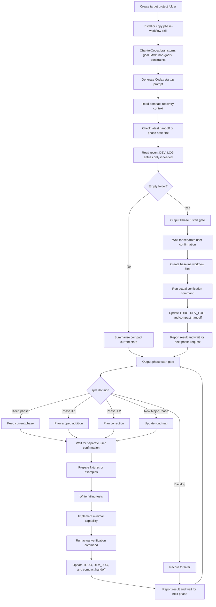

# phase-workflow

`phase-workflow` is a lightweight Codex workflow skill for early-stage, greenfield,
and MVP software projects. It helps keep long-running development work small,
explicit, verifiable, and recoverable across Codex sessions.

Its main purpose is not to make Codex plan. Codex can already plan. Its purpose is
to make planning, scope control, verification, and handoff repeatable through
project files instead of chat history.

Casually speaking, it helps everyone borrow useful MBTI J habits: clear plans,
explicit decisions, and verified next steps. The real value is engineering control:
new Codex windows can recover the work from files, and long conversations do not
have to keep compressing context until stale assumptions, lost decisions, mixed
context, or scope drift creep in.

The workflow is simple:

1. Lock the current phase boundary.
2. Prepare fixtures or examples.
3. Write failing tests.
4. Implement the smallest useful capability.
5. Verify with actual commands.
6. Update phase notes and handoff documents.
7. Move to the next phase only after verification.

The project is not a business application, a RAG system, a web UI, or a code
generation framework.

## What Problem It Solves

Early projects drift because scope, examples, tests, and handoff notes fall out of
sync. `phase-workflow` keeps them synchronized through a repeatable phase rhythm.

This is a scope-control workflow skill, not just a planning template. It prevents a
phase from silently absorbing future work. New ideas are classified before
implementation instead of being added directly to the active phase:

- `Phase X.1`
- `Phase X.2`
- `New Major Phase`
- `Backlog`

The goal is not to add process for its own sake. The goal is to make new project
work recoverable across Codex sessions without relying on chat history or a
compressed long conversation.

## What It Produces

A project using this workflow usually maintains:

- `AGENTS.md` - repository-level rules for Codex
- `PLAN.md` - phase roadmap
- `TODO.md` - active task and backlog
- `DEV_LOG.md` - development log
- `DECISIONS.md` - durable decisions
- phase notes - per-phase goal, verification, and handoff records
- handoff notes - current state for new Codex sessions

The output is not a complex tool. The output is recoverable project state that a
new Codex window can read before editing files.

## Core Guarantees

When used correctly, `phase-workflow` aims to ensure that:

- every phase has a narrow goal and explicit non-goals;
- examples or fixtures exist before implementation;
- tests define behavior before code is expanded;
- verification commands are actually run and recorded;
- the next Codex session can resume from project files.

Fixtures and tests are not ceremony. They define expected behavior before
implementation begins. A phase is not complete until verification results are
recorded; "should work" is not an exit criterion.

## Tradeoffs

`phase-workflow` may use more tokens than an ad hoc Codex chat because Codex checks
phase boundaries, records verification results, and maintains handoff notes.

The tradeoff is intentional: the workflow spends extra context on recoverability,
scope control, verification, and new-window handoff.

This has not been benchmarked yet. Actual token usage will depend on project size,
how many workflow files are read, and how often phases or sub-phases are updated.
Measured reports or practical suggestions are welcome.

To keep recovery context small, new Codex windows should start from compact current-state
files and the latest handoff note or phase note. Treat `DEV_LOG.md` as complete audit history:
read only the latest 1-3 `DEV_LOG.md` entries by default, and search older entries only when
state files conflict, verification is missing, or the user asks for history.

## How It Differs From Goal Mode

Codex Goal mode is useful when a single Codex thread needs to keep working toward
a persistent objective. `phase-workflow` is a file-based project workflow.

It stores continuity in repository files such as `PLAN.md`, `TODO.md`,
`DEV_LOG.md`, `DECISIONS.md`, phase notes, and handoff notes. It is not a
replacement for Goal mode, and it does not require Goal mode.

Use `phase-workflow` when project continuity should come from files rather than
from a thread-scoped goal.

## Good Fit

Use this skill for:

- Greenfield software projects.
- Early MVPs with changing requirements.
- Projects where Codex needs to resume work in a new window.
- Work that benefits from fixtures-first and tests-first development.
- Small teams or solo development where lightweight written context matters.

## Poor Fit

Do not use this skill for:

- Mature projects with established engineering process that should not change.
- One-off questions or tiny bug fixes that do not need phase tracking.
- Projects that already have strict project management, release, or compliance workflows.
- Work that needs a full issue tracker, database, cloud sync, or web UI.
- Business-specific workflows that should live in a separate project skill.

## Using It As A Codex Skill

`phase-workflow` is intended as a project-level workflow skill. Copy it into the
target repository so its rules and examples stay close to the project files it
helps maintain.

User-level installation is not recommended. This workflow is designed to live
with the project files it governs.

Recommended project-level installation layout:

```text
your-project/
  .codex/
    skills/
      phase-workflow/
        SKILL.md
        references/
        templates/
        examples/
```

Copy the whole `phase-workflow` folder into `.codex/skills/phase-workflow/`, not
only `SKILL.md`. Keep these paths together:

- `SKILL.md`
- `references/`
- `templates/`
- `examples/`

After installation, start with a short brainstorm. Define the project goal, MVP
boundary, non-goals, constraints, and success criteria before asking Codex to
create workflow files.

You can brainstorm in Chat first and ask Chat to generate a first Codex prompt, or
you can brainstorm directly in Codex. The Chat-to-Codex handoff is recommended,
not required.

## Compatibility

`phase-workflow` currently supports Codex only. Other agents have not been tested.

Claude Code support is planned for a future release.

## Example Prompts

The prompts do not need to be long once the workflow files exist. Short commands
are usually enough because Codex should read the project files and recover the
current state before editing.

### Startup Guidance

Before starting Phase 0, give Codex the project goal, MVP boundary, non-goals,
constraints, and success criteria. If you already discussed the project in Chat,
you can ask Chat to generate a first Codex prompt from that summary. This is
recommended, not required.

```text
Use phase-workflow for this repository. I want to brainstorm the project first.
Help me define the goal, MVP boundary, non-goals, constraints, and success
criteria before Phase 0.
```

### Short Prompts

```text
Phase 0 is complete. Start Phase 1.
```

```text
Start Phase 1.
```

```text
Use phase-workflow. Continue from project files and summarize state first.
```

```text
Classify this change request before implementation: ...
```

If Phase 0 is not complete, Codex should report that blocker instead of silently
starting Phase 1.

## Chat-to-Codex Startup Flow

Use Chat or Codex for product thinking, then use Codex for file-based execution:

1. Create a target project folder.
2. Install or copy the full `phase-workflow` skill.
3. Brainstorm the project goal, MVP boundary, non-goals, constraints, and success
   criteria in Chat or directly in Codex.
4. Optionally have Chat generate a Codex prompt that summarizes the agreed project
   direction.
5. In Codex, use that direction to create a rough phase plan in the target project.
6. Before starting each major phase, check whether the scope should stay whole or
   split into `Phase X.1`, `Phase X.2`, a later phase, or backlog.
7. Start Phase 0, or the next phase, only after user confirmation of the phase
   boundary.
8. After each phase completes, report verification results, scope status, and the
   next recommended action, then wait for user confirmation before continuing.

Do not split a major phase only because it has several tasks. Split only when the
work no longer fits one verification loop.

A request to start a phase, such as "start Phase X", "continue Phase X", or
"进行 Phase X", asks Codex to analyze the phase and show the phase start gate. It
does not authorize file edits. Codex should wait for separate user confirmation after the gate
before creating or modifying files.

**Strongly recommended, but optional:** if your Codex client supports Plan Mode, use it to
review the phase start gate and proposed execution plan before confirming file edits.
`phase-workflow` does not require Plan Mode.

## New Window Hygiene

**Strongly recommended, but optional:** start a new Codex window at the start of each phase,
and consider doing the same for each sub-phase. This keeps the working context short and helps
Codex recover from project files instead of compressed chat history. Treat it as a clean context
checkpoint.

At the start of each new window, include your desired response language in the opening prompt.
For example:

```text
Use phase-workflow for this repository. Do not rely on previous chat history.
Read AGENTS.md, PLAN.md, TODO.md, DECISIONS.md, and the latest handoff note or phase note
before editing files.
Read only the latest 1-3 DEV_LOG.md entries if recent verification or conflicts need context.

Desired response language: Chinese for this chat.
Keep project files in English unless I say otherwise.
```

The response language preference is for chat output only. It does not change the project file
language unless you explicitly ask for that.

## Workflow Diagram



## Optional Companion Tools

`phase-workflow` can be used alone.

It may pair well with [Superpowers](https://github.com/obra/superpowers) as an
optional companion for brainstorming, planning, TDD, and verification. Superpowers
is not required to use this skill.

## Recommended Flow

For each phase:

1. Define the phase goal, non-goals, inputs, outputs, and acceptance criteria.
2. Create or update fixtures and examples before implementation.
3. Write the failing tests that define the desired behavior.
4. Implement only the minimum capability needed for the phase.
5. Run the actual verification command, usually `python -m pytest -q`.
6. Record verification results in `TODO.md`, `DEV_LOG.md`, the phase note, and the
   handoff note.
7. Record durable process decisions in `DECISIONS.md`.

Keep the workflow small. If a request expands the MVP, classify it as `Phase X.1`,
`Phase X.2`, `New Major Phase`, or `Backlog` instead of disrupting the active phase.

## License

This project is licensed under the MIT License. See `LICENSE`.
